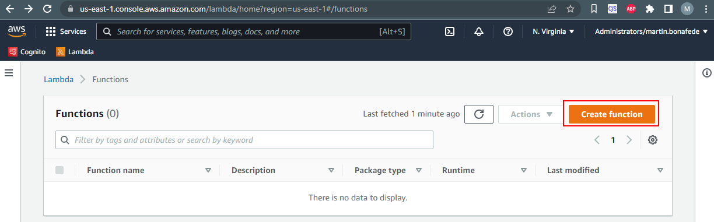
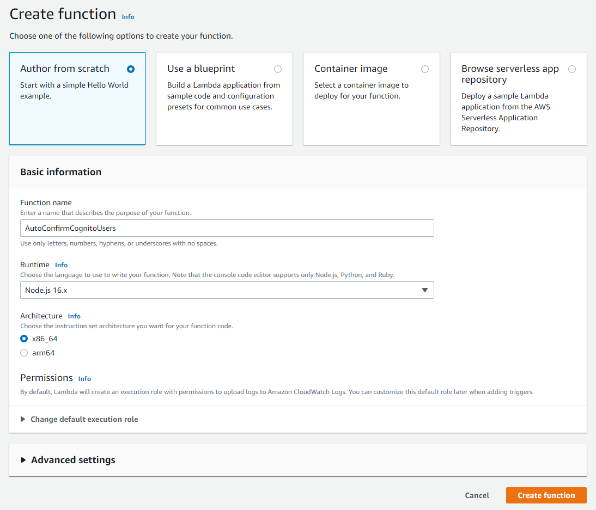
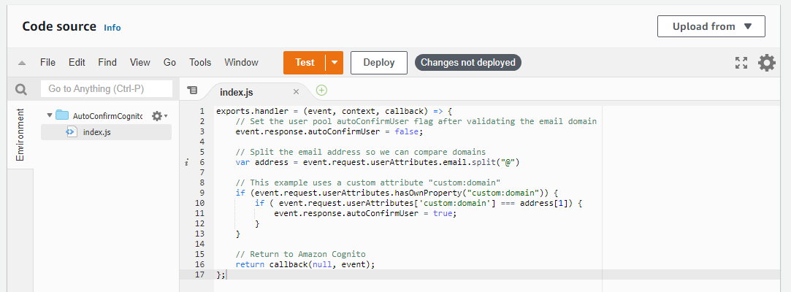
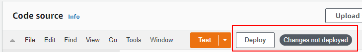
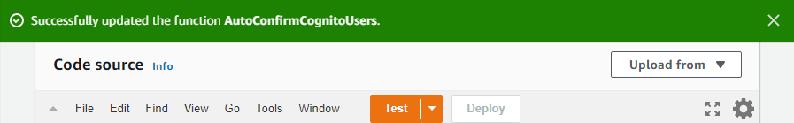
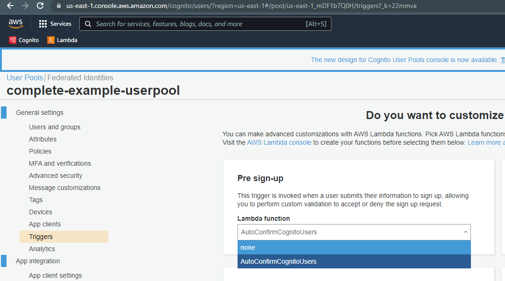

# Instructions

Lambda function for cognito autoconfirm users.

[Cognito](https://aws.amazon.com/cognito/) 
[Lambda](https://aws.amazon.com/lambda/)

[Documentation](https://docs.aws.amazon.com/cognito/latest/developerguide/user-pool-lambda-pre-sign-up.html)

## Overview

- [Instructions](#instructions)
  - [Overview](#overview)
  - [Configure Lambda](#configure-lambda)
    - [1. Create Lambda Function](#1-create-lambda-function)
    - [2. Upload Code](#2-upload-code)
    - [3. Deploy](#3-deploy)
  - [Configure Cognito](#configure-cognito)

## Configure Lambda

### 1. Create Lambda Function

Go to amazon lambda and create a function



Set up a name for the function and a runtime, int his case node.js 16.x. Then click "create the function".




  
### 2. Upload Code

You can manually copy the content of index.js of this solution to the index.js of the code source.




Or as alternative you can upload the code, if you are windows user, running the following code. It will just create a .zip file with the index.js

```bash
tar -a -c --exclude="*.zip" --exclude="./doc/" --exclude="readme.md" -f lambda.zip *
```

And then upload from the "Upload from" button.


### 3. Deploy


The changes are not saved until you deploy it.







**[⬆ back to top](#overview)**


## Configure Cognito

Go to cognito user pool that you want the user to autoconfirm. Then on "General Settings/Triggers" you will se your function available on each Lambda function dropdown. Select it on Pre sign-up.





**[⬆ back to top](#overview)**